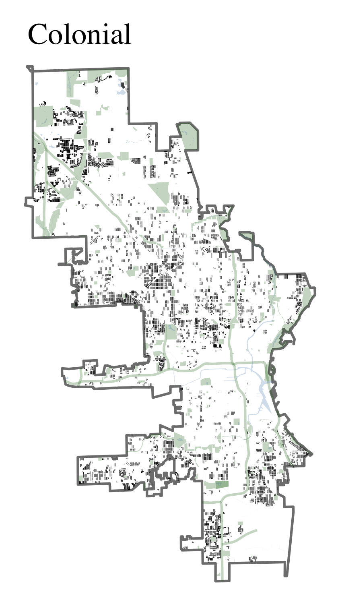

# milwaukee-house-styles

Like a tree, Milwaukee's residential neighborhoods spread in concentric rings around the downtown commercial core. Each layer preserves a distinctive swathe of homes, bearing witness to the way a generation of Milwaukeens lived and worked, all while likewise shaping the way every subsequent generation experiences their city.

--------------------------------------------------------------------------------
**Please note:** A previous version of the repository focused exclusively on "residential properties" (`C_A_CLASS == 1`). The repository has been updated to incorporate additional information added by the Assessor's Office in recent years.

--------------------------------------------------------------------------------

The Milwaukee Assessor's Office maintains an extensive database of property records. They assign one of a list of architectural styles to each house in Milwaukee. This repo shows ways of using this data.

The core parcel-level data is in `data/ParcelsWithBuildingTypes.csv`. See the [README](/data/) for details and documentation.

Read the City Assessor's definitions of each home style in the [building type README](/building-type-classification/).

One good way to map this data is at the face-block level. A shapefile of residential face-blocks is available to download at `housing_face_blocks/Archive.zip`. See how it was made in [`scripts/CreateHousingFaceBlocks.R`](scripts/CreateHousingFaceBlocks.R).

--------------------------------------------------------------------------------
**Here are a few examples of how this data can be visualized.**

See [`scripts/CreateHousesBuiltByYearDensityPlot.R`](https://github.com/jdjohn215/milwaukee-house-styles/blob/main/scripts/CreateHousesBuiltByYearDensityPlot.R) for the code.

See [`scripts/CreateHouseStyleYearBuiltBoxplot.R`](https://github.com/jdjohn215/milwaukee-house-styles/blob/main/scripts/CreateHouseStyleYearBuiltBoxplot.R) for the code.

See [`scripts/CreateHouseStyleMaps.R`](https://github.com/jdjohn215/milwaukee-house-styles/blob/main/scripts/CreateHouseStyleMaps.R) for the code.

These are some of Milwaukee's most common housing types. Each was dominant in their age, and they reflect contemporary modes of transportation. Old walking neighborhoods with modest cottages give way to a thick ring of duplexes whose working class occupants commuted on the new streetcars. The prosperity of the Roaring Twenties produced Milwaukee's narrow Bungalow Belt, and this pattern was repeated in turn with thousands of Cape Cod homes after World War II. As the 1950s progressed, Cape Cods gave way to newly popular Ranch homes.

  
   
  
  
  

Other styles are less associated with a single wave of building. Mansions, for instance, are limited to a handful of places in the City. Most notably, there is a large collection of mansions near Lake Park on the Upper East Side, but there are also pockets of these dwellings on the Near West Side and in Washington Heights. Similarly, Tudor-style homes are built in thick clusters in neighborhoods including Sherman Park and Story Hill. The "Colonial Style", as evidenced by the boxplot above, has been popular for the longest period of time. This enduring appeal is reflected in its scattered distribution around the city.

  
   
  

